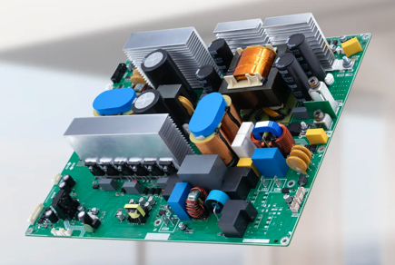
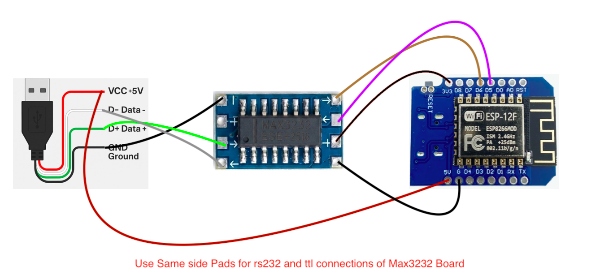

# Hybrid Solar Inverter RS232 (USB) Com

> **ESP8266 (Wemos D1 Mini) · Modbus RTU · RS232 via USB-A Socket · MQTT**

Read live data from a hybrid solar inverter over its RS232 Modbus port and publish it to an MQTT broker (e.g. Mosquitto on Raspberry Pi) for use with Node-RED, Home Assistant, or any MQTT-compatible dashboard.

---

## ⚠️ Disclaimer & Warning

> **USE ENTIRELY AT YOUR OWN RISK.**
>
> This project involves interfacing with electrical equipment including solar inverters, batteries, and mains-connected devices. Incorrect wiring, wrong voltage levels, or any modification to your inverter can cause **permanent equipment damage, electric shock, fire, or personal injury**.
>
> **The author of this repository takes absolutely no responsibility for any damage — to equipment, property, or persons — that may result from using, misusing, or modifying this code or wiring.** No warranty of any kind is provided. This project is shared purely as a personal experiment. You are solely responsible for your own actions.
>
> If you are not confident working with electronics, **do not proceed.**

---

## About the Inverter Communication Port

These hybrid solar inverters use a **USB Type-A socket** on the inverter body as their communication port — but it is **NOT a standard USB port**. It carries **RS232 signals** only and is completely incompatible with USB devices.

> ✅ **How to confirm:** Measure Pin 1 (VBUS) of the socket against GND with a multimeter while the inverter is powered on. A standard USB port reads **+5 V**. If it reads a **negative voltage** (typically −5 V to −10 V), it is definitively RS232. No USB device should ever be plugged into this port.

Because the connector is USB-A but the signal is RS232, the adapter chain is:

```
Inverter USB-A socket  →  USB-A to USB-A cable  →  MAX3232 RS232 side
```

The MAX3232 board converts the ±5–15 V RS232 levels down to 3.3 V TTL for the Wemos D1 Mini.

---

## Compatible Hardware

This code was developed and tested with an inverter built around a **high-frequency hybrid inverter PCB** — the type commonly found in 3–6 kW hybrid solar inverters sold under various brands across South/South-East Asia. The board features a toroidal transformer, PFC stage, full-bridge MOSFET topology, and exposes Modbus RTU communication via the USB-A RS232 port.



> *Typical hybrid solar inverter PCB that this code works with. The USB-A socket on the inverter chassis connects to this board's RS232 interface.*

If your inverter has this style of port and communicates via Modbus RTU at **9600 baud, 8N1**, this code is very likely compatible.

Tested With Model :
Gootu GT-H4865M27P9 6.5Kw Solar Hybrid Inverter Supporting 9000w PV

---

## Sketches

| Sketch | Folder | Description |
|---|---|---|
| `inverter_monitor.ino` | `inverter_monitor/` | Original — read-only telemetry monitor, publishes live data over MQTT |
| `inv_monitor_conf.ino` | `inv_monitor_conf/` | Extended — adds MQTT-controlled inverter settings writes with full flash-wear protection |

---

## Hardware Required

| Component | Details |
|---|---|
| Wemos D1 Mini | ESP8266-based, 3.3 V logic |
| MAX3232 mini board | RS232 ↔ TTL level shifter (3.3 V compatible) |
| USB-A to USB-A cable | Connects inverter RS232 port to MAX3232 RS232 side |
| Inverter with USB-A RS232 port | Modbus RTU, 9600 8N1 |
| Jumper wires | — |

---

## Wiring



> *Wiring: USB-A cable from inverter → MAX3232 mini board RS232 side → Wemos D1 Mini TTL side. Use same-side pads on the MAX3232 board for RS232 and TTL connections.*

```
Inverter          USB-A Cable       MAX3232 Board            Wemos D1 Mini
────────          ───────────       ─────────────            ─────────────
USB-A TX(D−) ──── White Wire ──   RS232-RX  →  TTL       ──  D6 (GPIO12) 
USB-A RX(D+) ──── Green Wire ──   RS232-TX  ←  TTL       ──  D5 (GPIO14) 
USB-A GND    ──────────────────    GND             GND   ──  GND
                                   VCC             3V3   ──  3V3
USB-A VCC     ────────────────── ────────────────── ──   ──  5V
```
Take Ref from Picture , MAX3232 Board RX TX is marked as  ──► and can confuse

> **Important:** Connect RS232 side and TTL side to the **same side pads** of the MAX3232 mini board as labelled. Do not cross RS232 and TTL pads.

---

## Libraries

Install these via **Arduino IDE → Library Manager**:

- `PubSubClient` by Nick O'Leary
- `ArduinoJson` by Benoit Blanchon
- `ESP8266WiFi` — bundled with the ESP8266 Arduino board package

---

## inverter_monitor — Original Sketch

Read-only telemetry sketch. Publishes live inverter data to MQTT. No settings writes.

### Configuration

Open `inverter_monitor/inverter_monitor.ino` and edit only this block at the top:

```cpp
// WiFi
#define WIFI_SSID        "YourWiFiSSID"
#define WIFI_PASSWORD    "YourWiFiPassword"

// MQTT Broker
#define MQTT_SERVER      "192.168.1.x"   // IP of your MQTT broker
#define MQTT_PORT        1883
#define MQTT_USER        ""              // leave empty if no auth
#define MQTT_PASS        ""              // leave empty if no auth
#define MQTT_CLIENT_ID   "inverter_d1"   // unique device name
#define MQTT_BASE_TOPIC  "inverter"      // root topic prefix

// Polling
#define POLL_SECONDS     10              // how often to read (seconds)
```

### MQTT Topics Published

All values are published under `<MQTT_BASE_TOPIC>/` with `retain = true`.

| Sub-topic | Unit | Description |
|---|---|---|
| `status` | `online` | Published on connect |
| `mains_voltage` | V | Grid/mains voltage |
| `mains_frequency` | Hz | Grid frequency |
| `grid_power_w` | W | Grid power import/export |
| `pv1_voltage` | V | Solar panel voltage |
| `pv1_current` | A | Solar panel current |
| `pv1_power_w` | W | Solar panel power |
| `daily_pv_kwh` | kWh | PV energy generated today |
| `total_pv_kwh` | kWh | Total lifetime PV energy |
| `battery_voltage` | V | Battery terminal voltage |
| `battery_soc` | % | Battery state of charge |
| `bus_voltage` | V | DC bus voltage |
| `battery_chg_amps` | A | Charge current (positive when charging, else 0) |
| `battery_dis_amps` | A | Discharge current (positive when discharging, else 0) |
| `battery_current` | A | Signed current (+ discharge / − charge) |
| `charging_status` | 0–3 | 0=None 1=CV/CC 2=Float 3=Equalize |
| `ac_load_w` | W | AC output load power |
| `daily_output_kwh` | kWh | AC energy output today |
| `inv_temp_c` | °C | Inverter heat-sink temperature |
| `chg_temp_c` | °C | Charger heat-sink temperature |
| `fan_speed_pct` | % | Cooling fan speed |

---

## inv_monitor_conf — Settings Control Sketch

Extends the original telemetry monitor with **MQTT-controlled inverter settings writes**. Designed with maximum protection against flash wear on both the inverter and the ESP8266.

### Key Features

- **Read-only telemetry** — all live data polling uses FC03 (read-only Modbus), never touches settings registers
- **MQTT settings writes** — send one parameter at a time via `inverter/settings/set`
- **Read-before-write** — reads the current register value first; skips FC10 write if the inverter already holds the same value
- **500 ms minimum write gap** — enforced in RAM to match inverter timing requirements
- **No retry on failure** — a failed write is final; no automatic retry loop
- **No writes on boot/reconnect** — `setup()` has zero FC10 calls; reconnect logic has zero Modbus calls
- **Retained MQTT cleanup** — publishes empty retained message to command topic on connect to prevent stale command replay after reboot
- **ESP flash protection** — `WiFi.persistent(false)` prevents credential writes to ESP8266 flash on every reconnect
- **Single write path** — `sendFC10()` has exactly one call site: `writeIfChanged()`
- **Validation before write** — every setting is range-checked and battery-type-checked before any write is attempted

### Supported Settings (via MQTT)

| MQTT Key | Register | Description | Unit |
|---|---|---|---|
| `output_priority` | 0x4102 | 0=GPB 1=PGB 2=PBG 3=MKS | — |
| `grid_charge_current` | 0x4105 | Grid charge current | A |
| `max_charge_current` | 0x4106 | Max charge current | — |
| `battery_type` | 0x4107 | 0=AGM 1=Flooded 2=Ternary 3=LiFePO4 4=Custom | — |
| `battery_low_cutoff` | 0x4108 | Battery low-voltage cutoff | 0.1V |
| `battery_undervoltage` | 0x4109 | Under-voltage shutdown point | 0.1V |
| `cv_point` | 0x410A | Constant voltage (CV) point | 0.1V |
| `float_voltage` | 0x410B | Float voltage point | 0.1V |
| `switch_to_grid_voltage` | 0x410C | Switch-to-grid voltage | 0.1V |
| `return_to_battery_v` | 0x410D | Return-to-battery voltage | 0.1V |
| `grid_feed_in_enable` | 0x412E | Grid feed-in 0=OFF 1=INT | — |

### MQTT Usage

**Read all current settings:**
```
Topic:   inverter/settings/get
Payload: all
```

**Write a single setting:**
```
Topic:   inverter/settings/set
Payload: {"cv_point": 57.0}
```

Only one key per message is accepted. Multi-key JSON is rejected.

**Settings status feedback:**
```
Topic:   inverter/settings/status
```
Reports `write_ok`, `already_set`, `write_fail`, `validation_error`, or `parse_error`.

### Configuration

Open `inv_monitor_conf/inv_monitor_conf.ino` and edit the same WiFi/MQTT block as the original sketch.

---

## Flash Wear Protection

Both sketches call `WiFi.persistent(false)` before `WiFi.begin()`. This prevents the ESP8266 SDK from writing WiFi credentials to flash on every connect/reconnect. No EEPROM, SPIFFS, or LittleFS is used — all runtime data lives in RAM. The `inv_monitor_conf` sketch additionally uses read-before-write and a 500 ms write gap to minimise inverter register write cycles.

---

## License

MIT License

Copyright (c) 2026

Permission is hereby granted, free of charge, to any person obtaining a copy of this software to deal in the Software without restriction, including without limitation the rights to use, copy, modify, merge, publish, distribute, sublicense, and/or sell copies of the Software, and to permit persons to whom the Software is furnished to do so, subject to the following conditions:

The above copyright notice and this permission notice shall be included in all copies or substantial portions of the Software.

THE SOFTWARE IS PROVIDED "AS IS", WITHOUT WARRANTY OF ANY KIND. THE AUTHOR SHALL NOT BE HELD LIABLE FOR ANY DAMAGES ARISING FROM THE USE OF THIS SOFTWARE.
